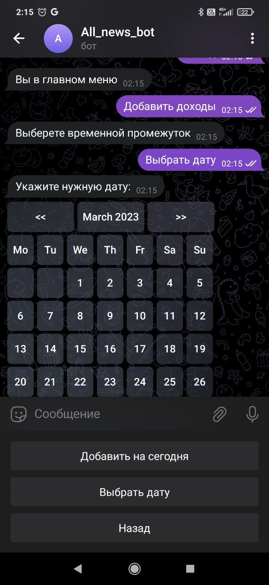
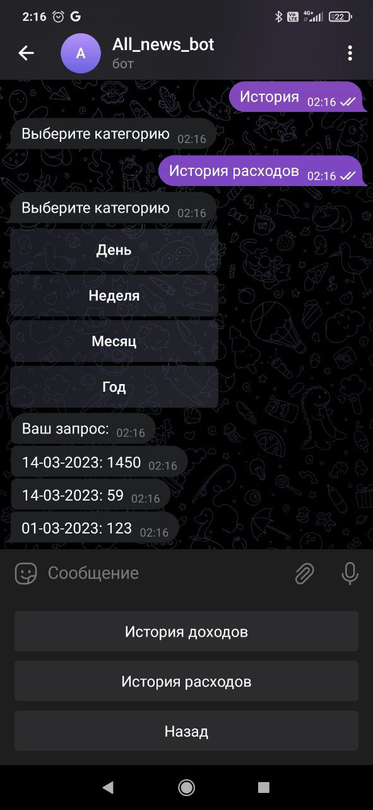
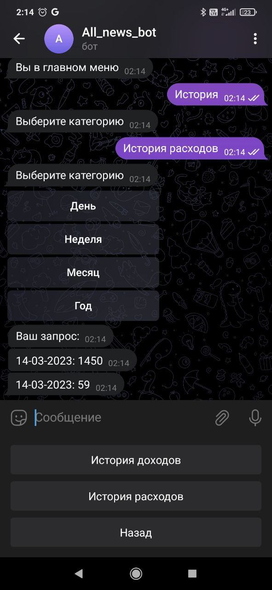

# Bot-Accountant
Данный проект сделан для освоение навыков работы с PostgreSql.

В файле GUI расположены все кнопки и клавиатуры.

В файле Database расположен код создания таблиц.

Main - главный файл с ботом

Visualization_db - визуализация данной базы данных.

images - папка со скриншотами примера работы.

  
  
  

  
  
  

